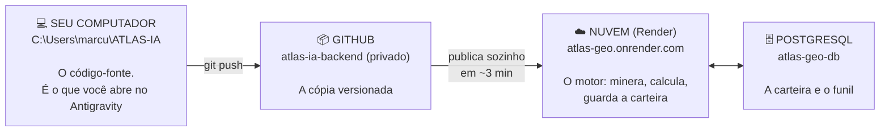

# ATLAS-IA

**Inteligência forense aplicada a autos de infração ambiental do IBAMA.**

Este arquivo é o ponto de entrada. Foi escrito para quem **não é
desenvolvedor** — se algo aqui parecer jargão, é falha do texto, não sua.

---

## 1. O que o sistema faz

Duas coisas distintas, que compartilham o mesmo motor:

**Audita processos.** Aplica um protocolo de **60 itens de verificação** sobre
as peças de um auto de infração e aponta o que está faltando, incoerente ou mal
instruído. Cada item tem peso conforme a gravidade técnica.

**Encontra clientes.** Todo dia de madrugada baixa a base pública do IBAMA,
identifica os autos com **prazo de defesa ainda aberto**, ranqueia por
relevância e busca telefone e endereço do autuado na Receita Federal.

Hoje, em produção: **10.784 autos** em carteira, **R$ 3,31 bilhões** em multas
acompanhadas, **132 com prazo vencendo**.

---

## 2. Onde cada coisa mora

O sistema não vive num lugar só. Confundir os três é a origem de quase toda
dúvida prática.



> **Por que `atlas-geo.onrender.com` abre um texto esquisito e não uma tela?**
> Porque aquele endereço é o **motor**, e motor conversa com aplicativo, não com
> gente. O texto que aparece é o painel de instrumentos dizendo que está no ar.
> As telas para pessoas são o **console** (`/console`) e o **aplicativo**.

---

## 3. As telas

| Tela | Endereço | Para quem |
|---|---|---|
| **Console de prospecção** | <https://atlas-geo.onrender.com/console> | Equipe — boletim do dia, prazos vencendo, funil comercial |
| **Aplicativo de análise** | `frontend/` — roda em `localhost:5173` | Atendimento ao interessado |

Cada pessoa entra com **sua própria senha**. Estão em
`docs/ACESSOS-EQUIPE.txt` — mande só a linha de cada um, nunca o arquivo.

---

## 4. O que cada arquivo faz

### O motor (raiz do projeto)

| Arquivo | Em uma frase |
|---|---|
| **`catalogo.json`** | **O ativo do negócio.** Os 60 itens de verificação e as 28 teses, cada um com a leitura técnica e a jurídica lado a lado. Mudar uma regra do negócio é mudar este arquivo — sem tocar em código. |
| `catalogo.py` | Aplica o catálogo às respostas e calcula o índice. É onde vive a separação entre o que vai para o cliente e o que vai para o advogado. |
| `main.py` | As portas de entrada. Cada endereço que o sistema atende está declarado aqui. |
| `prospeccao.py` | Baixa a base do IBAMA, limpa, deduplica e ranqueia os casos. |
| `rotina.py` | A rotina diária: sincroniza a carteira e monta o boletim. Tem o relógio interno que dispara às 06h. |
| `enriquecimento.py` | Busca razão social, endereço e telefone do autuado na Receita Federal. |
| `geo_service.py` | Cruza a coordenada do auto com os alertas de desmatamento do INPE. |
| `ai_service.py` | Gera o diagnóstico estratégico e as 7 peças, chamando a Claude. |
| `models.py` · `db.py` | O desenho das tabelas e a conexão com o banco. |

### As telas

| Pasta | O que é |
|---|---|
| `web/console-prospeccao.html` | O console da equipe. Arquivo único, sem instalação. |
| `frontend/` | O aplicativo React de análise. Precisa ser compilado. |

### O resto

| Pasta | O que é |
|---|---|
| `docs/` | Documentação, mapa detalhado, acessos da equipe, histórico. |
| `ferramentas/` | Scripts de apoio (copiar senha para a área de transferência). |
| `render.yaml` · `Dockerfile` · `requirements.txt` | Receita de publicação e lista de dependências. |

> ⚠️ **Os arquivos do motor ficam na raiz de propósito.** O Render publica a
> partir da raiz. Mover `main.py` para dentro de uma subpasta **quebra o site no
> ar**. Se a IDE sugerir "organizar melhor" movendo esses arquivos, recuse.

---

## 5. Abrindo no Antigravity

1. **File → Open Folder** → `C:\Users\marcu\ATLAS-IA`
2. O Antigravity lê o `AGENTS.md` sozinho. Esse arquivo conta a ele as regras do
   projeto — inclusive as armadilhas já encontradas, para não reintroduzi-las.
3. Pergunte o que quiser em português. Exemplos que funcionam bem:
   - *"Explique o que o arquivo catalogo.py faz, passo a passo."*
   - *"Quero adicionar uma pergunta nova ao módulo 5. Onde mexo?"*
   - *"Por que o console mostra menos casos do que o contador?"*

**Se a IDE propuser uma mudança que você não entende, peça para ela explicar a
consequência antes de aceitar.** O `AGENTS.md` instrui exatamente isso.

---

## 6. Rodando no seu computador

Você **não precisa** disso para usar o sistema — ele já está no ar. Isto é para
testar uma alteração antes de publicar.

### Uma vez só: instalar o que falta

| Programa | Onde baixar | Para quê |
|---|---|---|
| **Python 3.11+** | <https://python.org/downloads> — marque *"Add Python to PATH"* | roda o motor |
| **Node.js 20+** | <https://nodejs.org> | compila o aplicativo React |
| **Git** | <https://git-scm.com/download/win> | envia as mudanças |

### Subir o motor

No Antigravity, abra o terminal (**Terminal → New Terminal**) e digite:

```bash
pip install -r requirements.txt
uvicorn main:app --reload --port 8000
```

Abre em <http://localhost:8000/console>. O `--reload` faz o motor reiniciar
sozinho a cada arquivo salvo.

> Na primeira vez, copie `.env.example` para `.env` e preencha. Sem
> `DATABASE_URL`, ele usa um banco local de teste — **nunca use isso em
> produção**: os dados somem no primeiro reinício.

### Subir o aplicativo React

Em outro terminal:

```bash
cd frontend
npm install
npm run dev
```

Abre em <http://localhost:5173>.

---

## 7. Publicando uma mudança

A publicação é automática. Três comandos:

```bash
git add -A
git commit -m "descreva o que mudou e por quê"
git push
```

Em cerca de **3 minutos** o Render republica sozinho. Para conferir, abra
<https://atlas-geo.onrender.com/> e veja se responde.

### Antes de publicar, confira

- [ ] O motor sobe sem erro
- [ ] `http://localhost:8000/console` abre
- [ ] `cd frontend && npm run build` compila
- [ ] Nenhuma senha entrou no Git — o `.gitignore` já barra `.env`, mas confira

---

## 8. O que nunca deve sair daqui

| Item | Onde está | Por quê |
|---|---|---|
| `frontend/.env` | seu computador | contém a senha de acesso à API |
| `docs/ACESSOS-EQUIPE.txt` | seu computador | as senhas de toda a equipe |
| Senha do banco | só no painel do Render | dá acesso direto a toda a carteira |
| `ANTHROPIC_API_KEY` | só no painel do Render | chave de cobrança |
| O repositório | privado no GitHub | contém o `catalogo.json` inteiro |

---

## 9. Pendências com data

| Prazo | O quê |
|---|---|
| **29/09/2026** | O banco gratuito do Render **expira e é apagado** — junto vão os 10.784 casos e o funil. Cartão em *Billing*, plano Hobby, ~US$ 13/mês. |
| Antes do 1º cliente | Rastrear as taxas de êxito das 28 teses até fonte primária (TCU, IBAMA, PGFN). É a afirmação mais atacável do produto. |
| Antes da 1ª campanha | Validar a fronteira de captação — Provimento 205/2021 da OAB. Ver `docs/` e a pauta enviada à Dra. Emmanuelle. |

---

*Documentação técnica detalhada: `AGENTS.md` e `docs/MAPA-DO-PROJETO.md`.*
